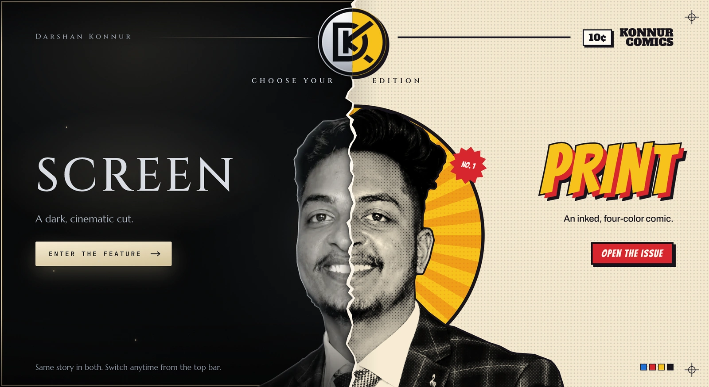
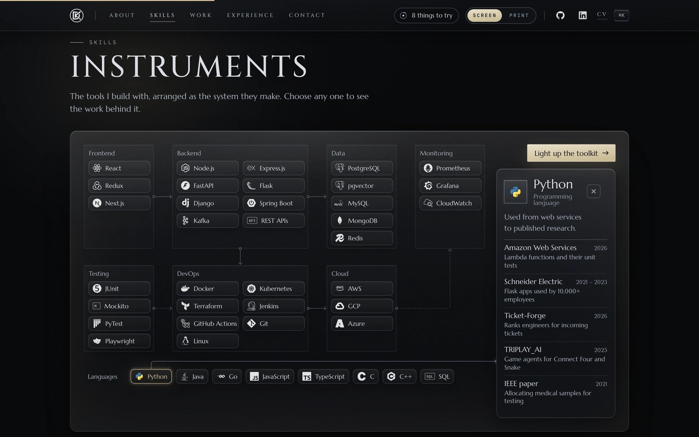
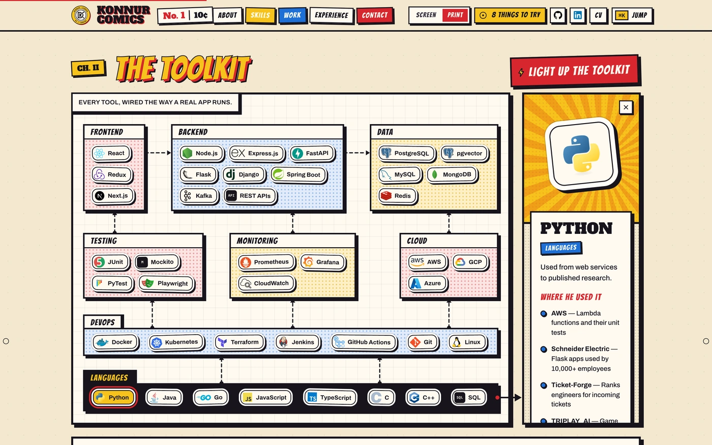
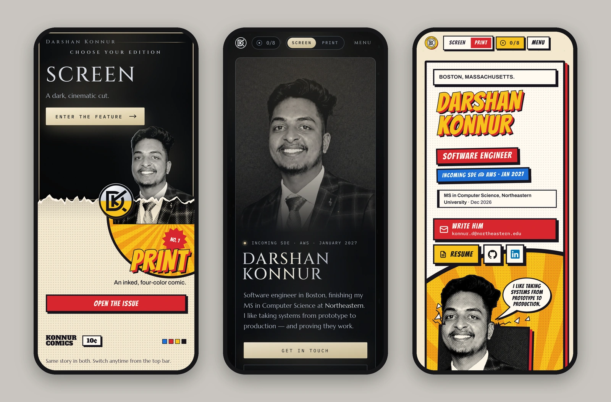
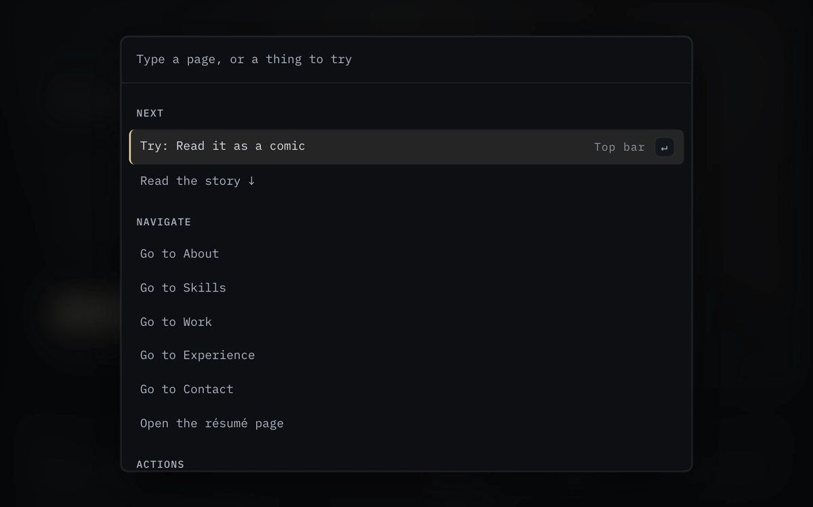
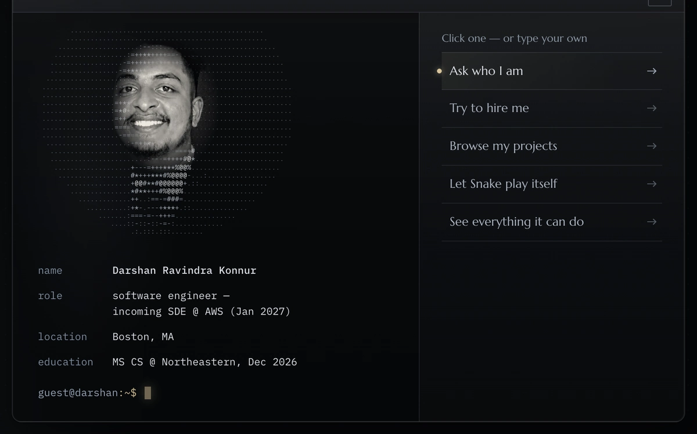
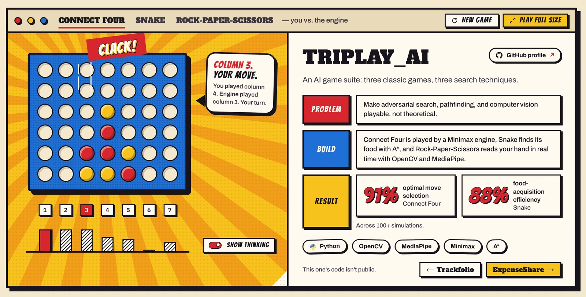
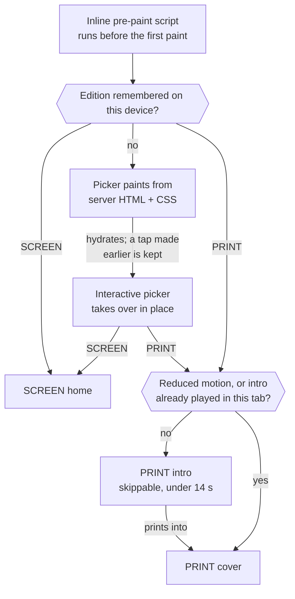
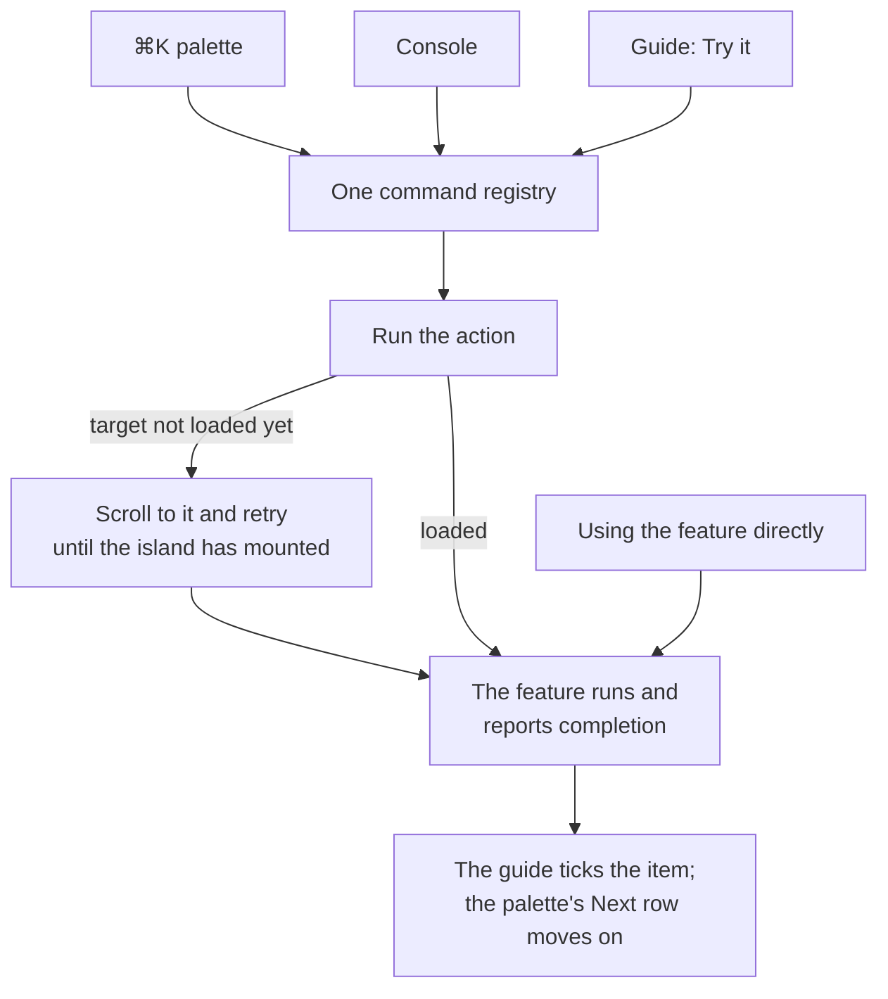

<p align="center">
  <a href="https://www.darshankonnur.com">
    
  </a>
</p>

<h1 align="center">Darshan Konnur</h1>

<p align="center">
  Software engineer in Boston&nbsp;·&nbsp;Incoming&nbsp;SDE at&nbsp;AWS&nbsp;(Jan&nbsp;2027)<br>
  MS in Computer Science, Northeastern&nbsp;University&nbsp;(Dec&nbsp;2026)
</p>

<p align="center">
  The source of this personal site: one story, told in two editions.<br>
  <b>SCREEN</b> is a dark, cinematic cut. <b>PRINT</b> is an inked, four-color comic.
</p>

<p align="center">
  <a href="https://www.darshankonnur.com"><b>Live site</b></a>
  &nbsp;·&nbsp;
  <a href="https://www.darshankonnur.com/cv"><b>CV</b></a>
  &nbsp;·&nbsp;
  <a href="https://www.darshankonnur.com/resume/darshan-konnur.pdf"><b>Résumé (PDF)</b></a>
  &nbsp;·&nbsp;
  <a href="mailto:konnur.d@northeastern.edu"><b>Email</b></a>
  &nbsp;·&nbsp;
  <a href="https://linkedin.com/in/darshankonnur"><b>LinkedIn</b></a>
</p>

<p align="center">
  <a href="https://github.com/darshanrk18/darshan-eportfolio/actions/workflows/ci.yml"></a>
  
  
  <a href="LICENSE"></a>
</p>

<p align="center">
  <a href="#two-editions">Two editions</a> ·
  <a href="#things-to-try">Things to try</a> ·
  <a href="#under-the-hood">Under the hood</a> ·
  <a href="#performance-and-accessibility">Performance and accessibility</a> ·
  <a href="#quality-gates">Quality gates</a><br>
  <a href="#working-on-the-code">Working on the code</a> ·
  <a href="#history">History</a> ·
  <a href="#credits">Credits</a> ·
  <a href="#license">License</a>
</p>

---

**In short**

- **What it is.** Darshan Konnur's portfolio: about, skills, seven projects, experience and contact on one page, plus a résumé page at [`/cv`](https://www.darshankonnur.com/cv) and a case study per project at `/work/<slug>`.
- **The idea.** The same story in two complete editions. A first visit asks which one to read; the choice is remembered and can be changed at any time from the top bar.
- **Built with.** Next.js 15.5 (App Router), React 19, TypeScript, Tailwind CSS v4, zustand, Motion, three.js and Vitest, on Node 24. Deployed on Vercel.
- **Read more.** [ARCHITECTURE.md](ARCHITECTURE.md) (how the editions share one page), [styles/v3/README.md](styles/v3/README.md) (the CSS side), [CHANGELOG.md](CHANGELOG.md), [SECURITY.md](SECURITY.md).

## Two editions

<p align="center">
  
  
</p>
<p align="center"><sub>The skills section in <b>SCREEN</b> (left) and <b>PRINT</b> (right): the same markup and the same content in a different skin.</sub></p>

|  | SCREEN | PRINT |
|---|---|---|
| **Look** | Black field, volumetric light, a metal-finish name, steel labels, highly transparent frosted glass | Cream paper, ink boxes, halftone photographs, stickers, comic lettering |
| **Type** | Cinzel, Marcellus and IBM Plex Mono; digits from Tenor Sans | Bangers, Alfa Slab One, Archivo and IBM Plex Mono; Anton in the intro |
| **Arrival** | The hero's own entrance, with a WebGL glyph field where the device has a hardware GPU | A skippable intro, under 14 seconds, that prints into the cover |
| **Portrait** | Resolves from characters into the photograph | The halftone dots dissolve into the photograph |

Switching keeps your place on the page. SCREEN → PRINT runs "the press": a dot wave spreads from the toggle, the color plates land slightly off register, then the ink settles. PRINT → SCREEN runs "the projector": the color drains, the dots swell and a key light rises. Each takes 700 ms. With reduced motion the switch is a 200 ms crossfade, and a browser without the View Transitions API switches at once. The palette (**Read it as a comic** / **See the screen edition**) and the console (`edition print`, `edition screen`) run the same switch.

<p align="center">
  
</p>

<p align="center">
  
</p>
<p align="center"><sub>On a phone: the picker, SCREEN and the PRINT cover.</sub></p>

## Things to try

**<kbd>⌘</kbd> <kbd>K</kbd>** (or <kbd>Ctrl</kbd> <kbd>K</kbd>) opens the command palette. It reaches every section and action, and its first row, **Next**, suggests something you have not tried yet. **The console** in the Contact section types `whoami --face` itself the first time it scrolls into view, then takes real commands.

<p align="center">
  
  
</p>
<p align="center"><sub>The palette with its <b>Next</b> row, and the console after <code>whoami --face</code>.</sub></p>

**"8 things to try"** sits in the top bar. It keeps track of what you have done and shows one hint at a time:

1. **Go anywhere**: the palette.
2. **Read it as a comic** (or, from PRINT, **See the screen edition**).
3. **Reveal the portrait**: glyphs, or halftone dots, resolving into the photograph.
4. **Light up the toolkit**: every skill in the system diagram switches on, one at a time.
5. **Play Connect Four** against a minimax engine (negamax with alpha-beta pruning).
6. **Open a project full size**: demo and case file together.
7. **See which skills each job used**: switch it on, then pick a job in the career graph.
8. **Ask the console who I am**.

The console's commands:

| Type | What happens |
|---|---|
| `whoami` | Name, role, location, education |
| <code>whoami&nbsp;--face</code> | The portrait, drawn in characters |
| <code>sudo&nbsp;hire&nbsp;darshan</code> | A reply, and the email address |
| <code>snake&nbsp;--autopilot</code> | Snake, played by an A* pathfinder that tints the cells it searched (`snake` to play it yourself) |
| <code>edition&nbsp;print</code> | Switches to PRINT (`edition screen` switches back) |
| `deploy` | Lights up the toolkit |
| `demo` | A short tour that drives the real palette and console; any key takes over |
| `help` | Everything else (there are a few more) |

<p align="center">
  
</p>
<p align="center"><sub>Connect Four in PRINT, inside its project window. With <b>Show thinking</b> on, the bars under the board are the engine's rating of each column.</sub></p>

<details>
<summary><b>Also on the page</b></summary>

<br>

- **Connect Four**: the engine runs in a Web Worker, so the board never waits on it.
- **Snake** with an A* autopilot, in the console and in a project demo; both tint the cells each search visited.
- **Rock, paper, scissors**: a 21-point hand skeleton cycling through the three poses, standing in for the project's hand tracking. It never opens the camera.
- **A skills system diagram** with each tool's official logo. Tap a skill to see where it was used.
- **A career graph**, newest first, that draws in one node at a time from the "Next" marker (the AWS role that starts in January 2027) down.
- **`/cv`**: the résumé as a page, with no JavaScript of its own and a print layout of its own.
- **`/arcade`**: both games at full size. It is not in the navigation and not indexed.

</details>

<details>
<summary><b>The seven case studies</b></summary>

<br>

| Project | In one line |
|---|---|
| [Ticket-Forge](https://www.darshankonnur.com/work/ticket-forge) | Ranks engineers for incoming DevOps tickets. |
| [Trackfolio](https://www.darshankonnur.com/work/trackfolio) | Versioned resumes, tracked applications. |
| [TRIPLAY_AI](https://www.darshankonnur.com/work/triplay-ai) | Three classic games, three search techniques. |
| [ExpenseShare](https://www.darshankonnur.com/work/expense-share) | Tracking and splitting shared expenses. |
| [Calendar (Java)](https://www.darshankonnur.com/work/calendar-java) | Engineered around SOLID and design patterns. |
| [Box Archive](https://www.darshankonnur.com/work/box-archive) | Enterprise archive, taken to production. |
| [Sample Allocation Optimizer](https://www.darshankonnur.com/work/ieee-mip-optimizer) | Medical-sample allocation, published with IEEE. |

</details>

## Under the hood

The whole page is one DOM. Both editions render the same markup, and a single attribute on `<html>` (`data-edition="screen"` or `"print"`) decides which skin's rules apply. Sections are React Server Components that render their finished state; small client islands hydrate the parts you can touch.

### A first visit



### Decisions

| What | Why |
|---|---|
| **One DOM, two skins.** `styles/v3/screen.css` and `print.css` style the same class names, each under its own `html[data-edition]` selector. Decoration only one edition shows is always rendered, `aria-hidden`, and hidden by the other skin. | One set of components to maintain, no hydration mismatch, and a switch that never reloads or loses your place. |
| **A pre-paint script.** An inline script of about 450 bytes, first in `<body>` ([`lib/edition/prepaint.ts`](lib/edition/prepaint.ts)), sets the edition, motion, picker and intro attributes. | The first paint is already the right edition, so there is no flash. The production minifier once broke it, so [`scripts/check-prepaint.mjs`](scripts/check-prepaint.mjs) now fails the build unless the prerendered script parses and writes every attribute. |
| **A server-rendered picker.** The picker's face is plain HTML and CSS, shown from the first paint ([`components/edition/PickerShell.tsx`](components/edition/PickerShell.tsx)); a small inline script queues a click, <kbd>Enter</kbd>, <kbd>1</kbd> or <kbd>2</kbd> made before hydration. | A first visit paints before any JavaScript runs, and no choice is lost while the interactive picker loads. |
| **Islands that fail alone.** Heavy surfaces load on demand with `next/dynamic`, and every dynamic import ends in `.catch(islandUnavailable)` ([`lib/utils/island.ts`](lib/utils/island.ts)). [`tests/islands.test.ts`](tests/islands.test.ts) fails if one does not. | A chunk that fails to load hides only its own island instead of replacing the page with an error screen. |
| **The engine off the main thread.** Connect Four is a bitboard negamax with alpha-beta pruning ([`lib/ai/connect4.ts`](lib/ai/connect4.ts)) running in a Web Worker; the same pure code is the main-thread fallback and the unit-test subject. | The board never freezes while the engine thinks. |
| **WebGL only where it helps.** The glyph field behind the SCREEN hero draws only in SCREEN, only with hardware WebGL2 (a software renderer counts as none), at a capped density, and unmounts off-screen. Everywhere else a static SVG stands in. | A CPU-rendered WebGL scene would block the main thread; PRINT and low-end devices never pay for it. |
| **Accessible by default.** Accessible names match the visible labels (WCAG 2.5.3). Reduced motion removes the intro and the entrance motion, keeps the glyph field static and turns the switch into a crossfade. Console ASCII art is hidden from screen readers, which hear a sentence instead. | The page works the same for keyboard, screen-reader and reduced-motion visitors. |

<details>
<summary><b>Six more decisions</b></summary>

<br>

| What | Why |
|---|---|
| **One command registry.** [`lib/commands/registry.ts`](lib/commands/registry.ts) is the only list of commands; the palette, the console and the guide's "Try it" all run through it. An action aimed at an island that has not loaded yet scrolls to it and retries until it mounts. | A feature completes the same way however it was reached, so the guide counts it once. |
| **Fonts per edition.** `next/font` serves seven Google families: six from the root layout, of which only SCREEN's (Cinzel, Marcellus, IBM Plex Mono) are preloaded, plus Anton, which loads with the PRINT intro. SCREEN's digits come from a 1.5 KB Tenor Sans subset. | The default path loads less. Marcellus draws 1 and 0 like I and O, so the numbers use a face where they read as numbers. |
| **`/cv` has no JavaScript of its own.** The root layout holds no client components, and smooth scrolling mounts on `/` only. | The résumé page is quick and prints cleanly. CI fails if its own JavaScript passes 0.5 KB gzipped. |
| **Analytics when idle.** Google Analytics loads with `lazyOnload`, and only when a measurement ID is set; events fired earlier are queued and replayed. | It stays off the critical path. |
| **Content is data.** Every fact a visitor reads lives in [`lib/data/`](lib/data); section copy lives in one copy module per area, never inline in JSX. | Facts change in one place, and tests can check the content rules. |
| **Strict response headers.** [`next.config.js`](next.config.js) forbids framing (`frame-ancestors 'none'`, `X-Frame-Options: DENY`), sets `nosniff` and a strict referrer policy, and sends a `Permissions-Policy` that turns off the camera, microphone, geolocation, payment and USB. No client source maps ship to production. | The site needs none of those capabilities, so none are granted. |

</details>

<details>
<summary><b>How a command travels</b></summary>

<br>



State shared between islands (the edition mirror, the palette and guide state, the active project, focused skills) lives in one zustand store, [`lib/state/store.ts`](lib/state/store.ts). Requests from one island to another travel as window events.

</details>

## Performance and accessibility

Production Lighthouse, mobile, on **September 30, 2026** (v3.1.0):

| Page | Visit | Performance | LCP | Runs |
|---|---|:---:|:---:|---|
| `/` | First visit (the picker) | **87** | 3.9 s | median of 3 |
| `/` | Return visit, SCREEN | **97** | 2.5 s | median of 3 |
| `/` | Return visit, PRINT (the intro plays) | **80** | 4.9 s | median of 3 |
| `/cv` | First visit | **99** | 2.0 s | median of 3 |
| `/work/ticket-forge` | First visit | **98** | 2.2 s | median of 3 |
| `/arcade` | First visit | **97** | 2.5 s | median of 3 |

**Accessibility 100** and **Best Practices 100** on all six. **SEO 100** on every page except `/arcade`, which is `noindex` on purpose.

<details>
<summary><b>Method</b></summary>

<br>

Lighthouse 12.8.2 in headless Chrome with the default mobile settings: simulated throttling (150 ms round trip, about 1.6 Mbps, 4× CPU slowdown) on a 412 px wide screen. Runs were made one at a time against the production deployment, with nothing else running. The first visit uses a fresh profile, so it measures the picker. Return visits reuse a profile with a stored edition; a new tab has no session flag, so the PRINT intro plays and its largest paint is an intro frame. Single runs vary (the three return-SCREEN runs scored 83, 97 and 97), so every row is the median of three. On the first visit the largest paint is the picker's title, drawn in the first frame; the simulated LCP is later than the first paint because the simulation also counts every file that finishes downloading before that frame.

</details>

### Budgets enforced in CI

| Budget | Limit | Measured | Checked by |
|---|:---:|:---:|---|
| First-load JavaScript for `/`, gzipped | 178 KB | 177.8 KB | [`measure-bundle.mjs`](scripts/measure-bundle.mjs) |
| `/cv`'s own JavaScript, gzipped | 0.5 KB | 0.2 KB | [`measure-bundle.mjs`](scripts/measure-bundle.mjs) |
| The inline pre-paint script, after minification | must parse | 574 B | [`check-prepaint.mjs`](scripts/check-prepaint.mjs) |

The 178 KB limit was set for 2.0.0 and has not moved since: 1.0.0's measured 166.1 KB plus an itemized list of what 2.0.0 added, smooth scrolling (9 KB) being the largest. 3.0.0 and 3.1.0 had to fit under the same limit, and the latest build of `main` measures 177.8 KB, so there is almost no headroom left.

`npm run build` measures every route and writes the numbers to [`lib/build/manifest.json`](lib/build/manifest.json), which the palette's **Build info** panel shows. The pre-paint check fails any build, anywhere, unless the prerendered script parses and writes every attribute. The bundle budget fails the build in GitHub Actions and only warns elsewhere, so a Vercel deploy never fails on a measurement.

## Quality gates

**On every pull request and every push to `main`**, in [`.github/workflows/ci.yml`](.github/workflows/ci.yml):

| Step | What runs, and what it covers |
|---|---|
| Typecheck | `npm run typecheck`: the whole project, in strict mode. |
| Lint | `npm run lint`: the `next/core-web-vitals` and `next/typescript` rules. |
| Unit tests | `npm test`: 329 tests in 21 files. Pre-paint parity over every input, the edition API and both switch choreographies, the picker shell, the island guard, the Connect Four engine, A*, the console interpreter, the command registry, the guide, the intro timeline (under 14 s), `/cv` (its content, no JavaScript of its own, the print layout) and the content rules. |
| Build | `npm run build`: `next build`, the pre-paint check and the bundle budgets above. The budgets are written to the job summary. |
| Browser smoke test | [`scripts/qa/smoke.mjs`](scripts/qa/smoke.mjs) drives Chrome through that build, served with `npm start`: a first visit through the picker, the switch both ways, the PRINT intro and its Skip, a return visit, `/cv`, a case study, `/arcade` and the 404 page, then checks for sideways scrolling at 375 px. Any console error fails it. On a failure, its screenshots and the server and build logs are attached to the run. |

The CI token is read-only, every action in both workflows is pinned to a full commit SHA, and a new push to a pull request cancels the run it replaces.

**Also:**

- **Live link check**, every Monday ([`.github/workflows/links.yml`](.github/workflows/links.yml)): lychee follows every link on the live site's pages (the sitemap, plus `/cv` and `/arcade`). A broken link opens an issue labeled `broken-links`, or updates the one already open.
- **Dependabot** ([`.github/dependabot.yml`](.github/dependabot.yml)): npm updates weekly and GitHub Actions updates monthly, grouped. Major versions of Next.js, React, Tailwind and Vite are left for a manual migration. Security alerts and security-fix pull requests are on.
- **Vercel** builds every pull request as a preview deployment.

- **Dependency review** on every pull request: a change that adds a dependency with a known high-severity vulnerability fails.
- **CodeQL** code scanning (GitHub's default setup) for the TypeScript and the workflows, on every push to `main` and every pull request.
- **Secret scanning** with push protection: a push that contains a key or token is blocked.
- **A ruleset on `main`**: no force pushes or deletion; changes arrive through pull requests that pass `verify`.

## Working on the code

### Getting started

Requires **Node 24** (pinned in [`.nvmrc`](.nvmrc)) and npm 11.

```bash
git clone https://github.com/darshanrk18/darshan-eportfolio.git
cd darshan-eportfolio
nvm use          # Node 24, from .nvmrc
npm ci
npm run dev      # http://localhost:3000
```

A production build, served locally, then the browser smoke test against it:

```bash
npm run build    # next build, then the pre-paint check and the bundle measurement
npm start        # http://localhost:3000

# in a second terminal
npm run smoke -- --base http://localhost:3000
```

The smoke test finds Chrome on macOS and Linux by itself, or uses `CHROME_PATH`. Add `--out <dir>` to keep its screenshots. `npm run build` rewrites `lib/build/manifest.json` with the new measurements; commit it with the change that moved them.

**Seeing the picker again.** The choice is stored on the device. Clear the site's data, or run **Choose your edition** from the palette. To check reduced motion without changing your system setting, type `motion off` in the console (`motion on` restores it).

**Pull requests** fill in the checklist in [`.github/PULL_REQUEST_TEMPLATE.md`](.github/PULL_REQUEST_TEMPLATE.md): screenshots in both editions, the budgets, reduced motion and keyboard access.

### Deployment

The site runs on **Vercel**. `main` deploys to production at [www.darshankonnur.com](https://www.darshankonnur.com), and every pull request gets its own preview deployment. [`vercel.json`](vercel.json) sets the build command (`npm run build`) and the region (`iad1`, US East). Changes land through pull requests that the owner merges with a merge commit.

<details>
<summary><b>Scripts</b></summary>

<br>

| Command | What it runs |
|---|---|
| <code>npm&nbsp;run&nbsp;dev</code> | `next dev` |
| <code>npm&nbsp;run&nbsp;build</code> | `next build`, then [`check-prepaint.mjs`](scripts/check-prepaint.mjs), then [`measure-bundle.mjs`](scripts/measure-bundle.mjs) |
| <code>npm&nbsp;start</code> | `next start` |
| <code>npm&nbsp;run&nbsp;typecheck</code> | `tsc --noEmit` |
| <code>npm&nbsp;run&nbsp;lint</code> | `eslint .` |
| <code>npm&nbsp;test</code> | `vitest run` |
| <code>npm&nbsp;run&nbsp;smoke</code> | `scripts/qa/smoke.mjs`, the browser smoke test. It needs a running server; `--base` defaults to `http://localhost:3000`. |

**The headless QA driver.** `node scripts/qa/cdp.mjs <plan.json> [--base http://127.0.0.1:3150]` drives headless Chrome through a JSON plan: seed the stored edition and guide state, set a viewport, navigate, scroll, click, type, take screenshots, and dump visible text and accessible names. Plans live in [`scripts/qa/plans/`](scripts/qa/plans). It expects Chrome at the macOS application path.

</details>

<details>
<summary><b>Environment variables</b></summary>

<br>

None are required. To set any, copy [`.env.example`](.env.example) to `.env.local` (ignored by git).

| Variable | Purpose | When unset |
|---|---|---|
| `NEXT_PUBLIC_SITE_URL` | Canonical origin for metadata, the sitemap, robots and JSON-LD | `https://www.darshankonnur.com` |
| `NEXT_PUBLIC_GA4_MEASUREMENT_ID` | Google Analytics 4 | No analytics are loaded |
| `NEXT_PUBLIC_VERCEL_GIT_COMMIT_SHA` | The commit shown in Build info; set by Vercel at build time | Shows `dev` |

</details>

<details>
<summary><b>Project layout</b></summary>

<br>

```text
app/                 Routes: /, /cv, /work/[slug], /arcade and the 404;
                     metadata, sitemap, robots and the share card
components/
  edition/           The picker (server shell + interactive surface), the toggle
  hero/              The name, the lede and the WebGL glyph field
  about/             The portrait and the photo strip
  skills/            The system diagram and the skill inspector
  projects/          Project windows, case files and the demos
  work/              The /work/<slug> case-study page
  arcade/            The /arcade games
  experience/        The career graph and the skills-per-job highlight
  contact/           Contact links and the console
  palette/           The ⌘K palette and the Build info panel
  guide/             "8 things to try": the chip, the list and the hints
  intro/             The PRINT intro
  chrome/ footer/    Navigation bar, section headers, footer
lib/
  data/              Every fact a visitor reads
  edition/           The pre-paint script and the edition constants
  commands/          The command registry and the edition switch
  guide/ intro/      The guide's items and actions; the intro timeline
  ai/                The Connect Four engine (and its worker) and A*
  perf/ motion/      Device tiers for WebGL; motion hooks and tokens
  state/             The zustand store
  utils/             Island guard, share tags, analytics, clipboard, seeded RNG
  build/             The build manifest that Build info reads
styles/v3/           The two skins, the switch, one stylesheet per section
styles/v2/           v2 rules still in use (portrait, CRT mode, project window)
public/              Photographs in both grades, logos, fonts, the résumé PDF
scripts/             Build guards, the browser smoke test, the headless QA driver
tests/               Vitest suites
docs/readme/         Images for this README
.github/             CI, the weekly link check, Dependabot, issue and PR templates
```

</details>

<details>
<summary><b>Content</b></summary>

<br>

- **Facts** live in [`lib/data/`](lib/data): `profile`, `projects`, `experience`, `skills` (with the verified map of where each skill was used), `publication`, `resume` (the text of `/cv`; server-only, so none of it reaches the browser's JavaScript), `photos`, `logos`, `logoNotes`, `hero`, `about`, `issue`, `introAssets`, `photoAscii`.
- **Section copy** lives in one module per area: `components/{contact,skills,experience}/copy.ts`, `components/projects/demos/c4Copy.ts`, `components/edition/picker.shared.ts`, `lib/guide/guide.ts`.
- **Rules the tests enforce**: no placeholders, no build or pipeline internals in visible text, and no skill claimed where the usage map does not verify it.
- **Photographs**: each section photograph ships in two grades, one per edition (`public/photo/<name>-41*.webp` for SCREEN, `<name>-paper*.webp` for PRINT). `/cv` shows the portrait in the edition's grade as a CSS background, so only one grade is fetched, and the intro's photo plates are in `public/intro/`. The résumé PDF is `public/resume/darshan-konnur.pdf`.
- **The share card** is [`app/opengraph-image.jpg`](app/opengraph-image.jpg) (1200 × 630): SCREEN on the left and PRINT on the right, split down the torn seam, with its alt text beside it. Each route sets its own share tags through `shareMeta()` in [`lib/utils/share.ts`](lib/utils/share.ts). The card's words are part of the picture, so it has to be re-rendered when the headline changes.

To change something: edit the data or the copy module, run `npm test`, open a pull request, and check the preview deployment in both editions.

</details>

## History

| Version | Date | What changed |
|---|---|---|
| **3.1.0** | Sep&nbsp;30,&nbsp;2026 | The site's own domain with share tags per page, the split SCREEN \| PRINT share card, the IEEE citation listing all six authors, SCREEN numerals that read as numbers, `/cv` rebuilt from the résumé, a public repository with CI, CodeQL and Dependabot, and layouts that fit tablets, short screens and phones ([#4](https://github.com/darshanrk18/darshan-eportfolio/pull/4)–[#7](https://github.com/darshanrk18/darshan-eportfolio/pull/7), [#12](https://github.com/darshanrk18/darshan-eportfolio/pull/12)–[#16](https://github.com/darshanrk18/darshan-eportfolio/pull/16)) |
| **3.0.0** | Sep&nbsp;30,&nbsp;2026 | SCREEN and PRINT: two complete editions, the picker, the PRINT intro, the guide, and a hardening pass (server-rendered picker, islands that fail alone, accessible names, performance) ([#3](https://github.com/darshanrk18/darshan-eportfolio/pull/3)) |
| **2.0.0** | Sep&nbsp;24,&nbsp;2026 | The elevation: the decompiled portrait, smooth scroll, the kinetic hero name, the theme wipe, the boot sequence, project windows, CRT mode, the hidden `/arcade`, the palette narrator ([#2](https://github.com/darshanrk18/darshan-eportfolio/pull/2)) |
| **1.0.0** | Sep&nbsp;23,&nbsp;2026 | The terminal-styled rebuild: `/cv` and `/work` case files, the command palette, the contact terminal ([#1](https://github.com/darshanrk18/darshan-eportfolio/pull/1)) |

The full list is in [CHANGELOG.md](CHANGELOG.md).

## Credits

**Typefaces**, all under the SIL Open Font License 1.1:

| Family | Used for |
|---|---|
| [Cinzel](https://fonts.google.com/specimen/Cinzel) | SCREEN display |
| [Marcellus](https://fonts.google.com/specimen/Marcellus) | SCREEN body |
| [Tenor Sans](https://fonts.google.com/specimen/Tenor+Sans) | SCREEN digits: a digits-only subset, self-hosted with its license in [`public/fonts/`](public/fonts) |
| [IBM Plex Mono](https://fonts.google.com/specimen/IBM+Plex+Mono) | Labels, code and the console, in both editions |
| [Bangers](https://fonts.google.com/specimen/Bangers) | PRINT display |
| [Alfa Slab One](https://fonts.google.com/specimen/Alfa+Slab+One) | PRINT headings |
| [Archivo](https://fonts.google.com/specimen/Archivo) | PRINT body |
| [Anton](https://fonts.google.com/specimen/Anton) | The PRINT intro's lettering |

**Logos.** Full-color skill logos come from [Devicon](https://devicon.dev) and single-color ones from [Simple Icons](https://simpleicons.org). Each logo is a trademark of its owner and is used only to name the tool.

**Libraries.** [Next.js](https://nextjs.org), [React](https://react.dev), [three.js](https://threejs.org) with [React Three Fiber](https://github.com/pmndrs/react-three-fiber), [Motion](https://motion.dev), [Lenis](https://github.com/darkroomengineering/lenis), [cmdk](https://github.com/pacocoursey/cmdk), [zustand](https://github.com/pmndrs/zustand) and [clsx](https://github.com/lukeed/clsx), each under the MIT License.

**Photographs** © Darshan Ravindra Konnur.

## License

**All rights reserved.** © Darshan Ravindra Konnur. The code, the copy and the photographs in this repository are not licensed for reuse. See [LICENSE](LICENSE).

To report a security problem, see [SECURITY.md](SECURITY.md): by email, not in an issue. Something wrong on the site: open a [bug report or content update](https://github.com/darshanrk18/darshan-eportfolio/issues/new/choose). Anything else: [konnur.d@northeastern.edu](mailto:konnur.d@northeastern.edu) or [LinkedIn](https://linkedin.com/in/darshankonnur).
